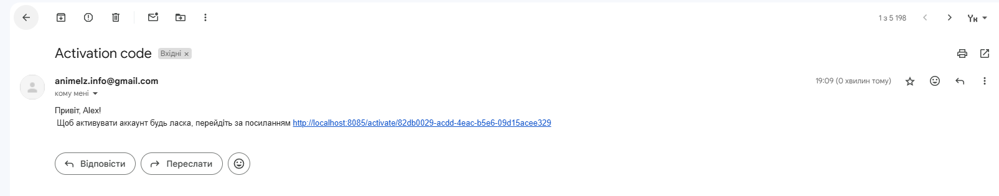
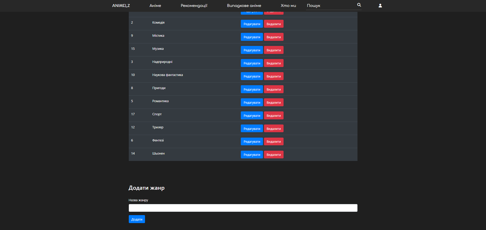
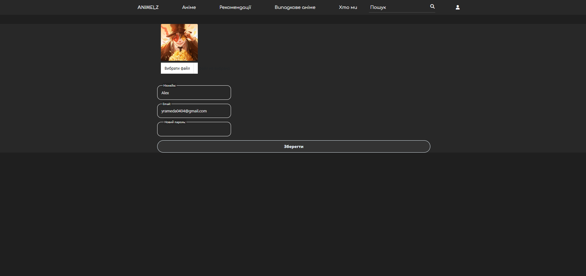
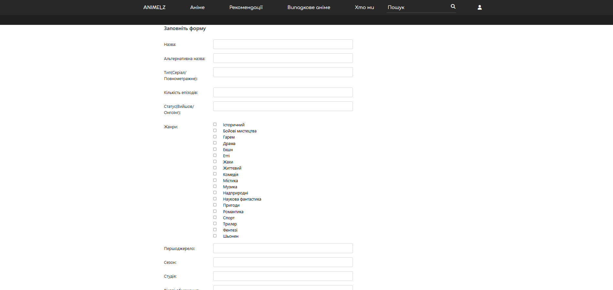
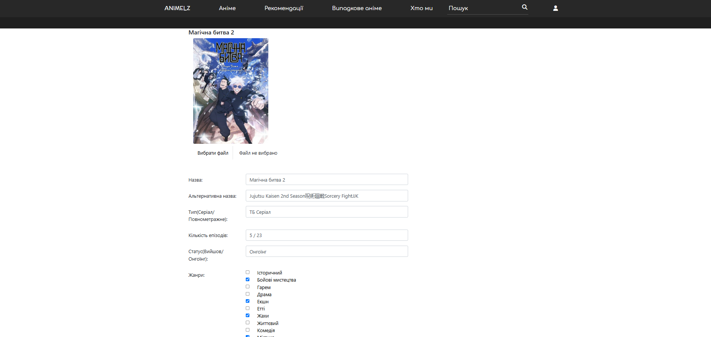

# Animelz 

Animelz is an anime viewing site that started as a small idea with no grand plans, and now I want to make it better. At first, everything seemed simple, but since I didn't have much experience with such projects, the development process was a real adventure. It happened that you were working on a feature and it stubbornly didn't work, you went into the logs and there were a lot of incomprehensible errors. And then you google it, find an article from five years ago that doesn't have any answers. You go back to the code again, try to figure out what's wrong, and without solving the problem, you go to bed. Suddenly, in the middle of the night, it dawns on you that you forgot to write the correct path. And such moments, when you realize that the problem is solved, are really inspiring, you want to experience this euphoria again and again.

Now I'm finishing the backend, I plan to make my own player and redesign the frontend a bit (I can already feel that I have difficulties with the design 😅). So if anyone wants to help, I'd be happy to hear from anyone who wants to join!

## Technologies:

* Java 17
* Spring (Boot, Data, Security, Mail)
* JPA / Hibernate
* MySQL
* Thymeleaf
* HTML, CSS, JS, Bootstrap
* Maven
* Lombok

## About This Project
* Users can register/login.
* Users can edit their data
* Users can find anime by filters or recommendations
* Users can rate anime
* Users can add anime to lists
* Users can watch anime

## Screenshots

Registration     |  Login
:------------------------:|:-------------------------:
  |  

Email letter| 
:------------------------:

List anime      |  Anime page
:------------------------:|:-------------------------:
  |  

User profile  |  Admin profile
:------------------------:|:-------------------------:
  |  

Add genre |  Edit profile
:------------------------:|:-------------------------:
  |  

Add anime  |  Edit anime
:------------------------:|:-------------------------:
  |  